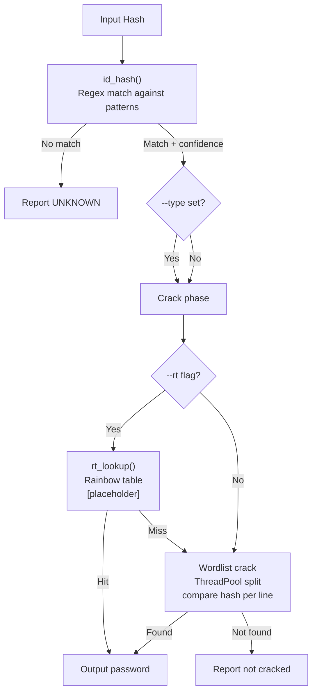

# CrackStation-CLI

Offline hash cracking suite. Regex-based hash identification, multithreaded wordlist cracking, built-in wordlist generator with mutations. Supports MD5, SHA1, SHA256, bcrypt, NTLM. Bcrypt fallback threaded — each thread gets its own bcrypt.checkpw call.

## Usage

```
python crackstation.py <hash> -w <wordlist> [-t threads] [--type TYPE] [-o output]
python crackstation.py -g <wordlist>        # generate wordlist
python crackstation.py --benchmark          # speed test
python crackstation.py <hash> --rt          # rainbow table check (placeholder)
```

### Examples

```bash
# identify & crack an MD5
python crackstation.py 5d41402abc4b2a76b9719d911017c592 -w rockyou.txt

# force type for ambiguous hashes
python crackstation.py A384F5F6B3E7A8B9C0D1E2F3A4B5C6D7 --type NTLM -w words.txt

# generate a starter wordlist
python crackstation.py -g mylist.txt

# benchmark your hardware
python crackstation.py --benchmark
```

## Hash Identification

| Hash   | Length | Pattern                              | Notes                              |
|--------|--------|--------------------------------------|------------------------------------|
| MD5    | 32     | `[a-f0-9]{32}`                       | Default for 32-char hex (lower)    |
| NTLM   | 32     | `[A-F0-9]{32}`                       | All-caps 32-char hex               |
| SHA1   | 40     | `[a-f0-9]{40}`                       |                                    |
| SHA256 | 64     | `[a-f0-9]{64}`                       |                                    |
| bcrypt | 60     | `\$2[abxy]\$\d{2}\$[./A-Za-z0-9]{53}` |                                    |

**Caveat:** NTLM detection is heuristic (all-uppercase 32-char hex). Upper-only MD5 would misidentify as NTLM. Use `--type` to override.

## How It Works



## Limitations

- No distributed/GPU cracking — CPU-only multithread.
- NTLM detection is heuristic, will misidentify all-uppercase MD5 hashes.
- bcrypt is slow (by design) — large wordlists can take a while even with threads.
- Rainbow table lookup is a stub. No actual .rt file support yet.
- No stdin piping for hashes yet.
- Wordlist generator is basic — not a replacement for real mutation engines like hashcat rules.

## TODO

- [ ] Chain length/time estimation before cracking starts
- [ ] RT backend (BLAKE2-based chain format)
- [ ] stdin mode for bulk hashes
- [ ] Hashcat-style rule engine option
- [ ] Per-iteration progress bar

## License

MIT
